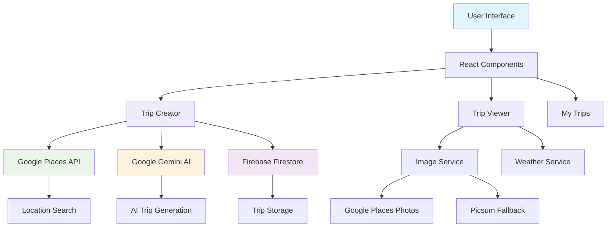

# 🌍 JourneySavvy AI - Your Intelligent Travel Companion

<div align="center">
  <h3>✨ Discover Your World: AI Crafts Your Perfect, Personalized Travel Itinerary ✨</h3>
  
  
  
  
  
  
  
</div>


## 🚀 Overview

**JourneySavvy AI** is a cutting-edge travel planning application that leverages the power of artificial intelligence to create personalized, detailed trip itineraries. Simply tell us your preferences, and our AI will craft the perfect travel experience tailored just for you!

### ✨ Key Features

- 🤖 **AI-Powered Trip Planning** - Advanced Google Gemini AI creates personalized itineraries
- 🗺️ **Smart Location Search** - Google Places API integration for accurate destination selection
- 🖼️ **Rich Media Experience** - High-quality images for destinations, hotels, and attractions
- ☁️ **Real-time Weather** - 5-day weather forecasts for your destination
- ✈️ **Flight Information** - Multiple flight options with pricing and alternatives
- 🏨 **Accommodation Suggestions** - Curated hotel recommendations with ratings and pricing
- 🍽️ **Local Cuisine Guide** - Traditional food recommendations with descriptions
- 📱 **Responsive Design** - Perfect experience across all devices
- 🔐 **Secure Authentication** - Google OAuth integration for user accounts
- 💾 **Trip Management** - Save, view, and manage all your trips

## 🏗️ Architecture Overview



## 🛠️ Tech Stack

### Frontend

- **React 19** - Modern UI library with latest features
- **TypeScript** - Type-safe development experience
- **Vite** - Lightning-fast build tool and dev server
- **Tailwind CSS** - Utility-first CSS framework
- **Shadcn/ui** - Beautiful, accessible UI components
- **React Hook Form** - Performant forms with easy validation
- **Zod** - TypeScript-first schema validation

### Backend & Services

- **Firebase Firestore** - NoSQL database for trip storage
- **Google Gemini AI** - Advanced AI for trip planning
- **Google Places API** - Location search and place details
- **Google Maps API** - Maps integration and geocoding
- **Google OAuth** - Secure user authentication

### Image Services

- **Google Places Photos API** - High-quality location images
- **Picsum** - Beautiful fallback images
- **Smart Image Service** - Intelligent image loading with fallbacks

## 🎯 Features in Detail

### 🤖 AI Trip Planning

Our advanced AI considers multiple factors to create your perfect trip:

- **Budget Analysis** - Optimizes recommendations within your budget
- **Traveler Preferences** - Adapts to solo, couple, family, or group travel
- **Duration Optimization** - Creates day-by-day detailed itineraries
- **Local Insights** - Includes cultural activities and hidden gems

### 🗺️ Smart Location Features

- **Autocomplete Search** - Find destinations with intelligent suggestions
- **Current Location Detection** - Easy starting point selection
- **Detailed Place Information** - Rich details about each destination
- **Coordinate Mapping** - Precise location data for all recommendations

### 🖼️ Rich Media Experience

- **High-Quality Images** - Stunning visuals for every recommendation
- **Fallback System** - Ensures images are always available
- **Responsive Loading** - Optimized for all connection speeds
- **Smart Caching** - Improved performance with intelligent caching

### 📱 User Experience

- **Intuitive Interface** - Clean, modern design that's easy to navigate
- **Mobile-First** - Perfect experience on phones, tablets, and desktops
- **Loading States** - Smooth transitions and progress indicators
- **Error Handling** - Graceful error management and user feedback

## 🚀 Getting Started

### Prerequisites

- Node.js 18+
- npm or yarn package manager
- Google Cloud Platform account
- Firebase project setup

### Installation

1. **Clone the repository**

   ```bash
   git clone https://github.com/masudursourav/AI-Trip-Planner.git
   cd AI-Trip-Planner
   ```

2. **Install dependencies**

   ```bash
   npm install
   ```

3. **Environment Setup**
   Create a `.env` file in the root directory:

   ```env
   # Google AI (Gemini)
   VITE_GEMINI_API_KEY=your_gemini_api_key

   # Google Maps & Places
   VITE_GOOGLE_MAPS_API_KEY=your_google_maps_api_key

   # Firebase Configuration
   VITE_FIREBASE_API_KEY=your_firebase_api_key
   VITE_FIREBASE_AUTH_DOMAIN=your_firebase_auth_domain
   VITE_FIREBASE_PROJECT_ID=your_firebase_project_id
   VITE_FIREBASE_STORAGE_BUCKET=your_firebase_storage_bucket
   VITE_FIREBASE_MESSAGING_SENDER_ID=your_firebase_messaging_sender_id
   VITE_FIREBASE_APP_ID=your_firebase_app_id
   VITE_FIREBASE_MEASUREMENT_ID=your_firebase_measurement_id
   ```

4. **Start the development server**

   ```bash
   npm run dev
   ```

5. **Open your browser**
   Navigate to `http://localhost:5173`

## 🔧 API Configuration

### Google Cloud APIs

Enable the following APIs in your Google Cloud Console:

- ✅ **Gemini AI API** - For AI trip generation
- ✅ **Places API (New)** - For location search and photos
- ✅ **Maps JavaScript API** - For map integration
- ✅ **Geocoding API** - For address conversion

### Firebase Setup

1. Create a new Firebase project
2. Enable Firestore Database
3. Configure authentication with Google provider
4. Add your domain to authorized domains

## 📁 Project Structure

```
src/
├── components/           # Reusable UI components
│   ├── ui/              # Shadcn/ui components
│   ├── custom/          # Custom components
│   └── icons/           # Icon components
├── create-trip/         # Trip creation workflow
├── my-trips/           # User's saved trips
├── view-trip/          # Trip details and itinerary
├── lib/                # Utilities and configurations
│   ├── AiModel.ts      # Google Gemini AI integration
│   ├── FireBaseConfig.ts # Firebase configuration
│   ├── improvedImageService.ts # Image service with fallbacks
│   └── validationSchemas.ts # Form validation schemas
├── types/              # TypeScript type definitions
└── utils/              # Helper functions
```

## 🎨 Component Architecture

### Trip Creation Flow

```typescript
TripCreator → DestinationSelector → CurrentLocationSelector →
DatePicker → BudgetSelector → TravelerSelector → AI Generation
```

### Data Flow

```typescript
User Input → Validation → AI Processing → Firebase Storage →
Trip Display → Image Loading → Weather Integration
```

## 🌟 Advanced Features

### Smart Image Service

- **Multi-source Strategy** - Google Places API with Picsum fallback
- **Caching Layer** - Reduces API calls and improves performance
- **Error Resilience** - Graceful degradation when services are unavailable
- **Responsive Images** - Optimized sizing for different screen sizes

### AI Trip Generation

- **Context-Aware Planning** - Considers location, season, and preferences
- **Budget Optimization** - Maximizes value within specified budget
- **Cultural Integration** - Includes local experiences and traditions
- **Practical Recommendations** - Real-world pricing and logistics

### Real-time Features

- **Live Weather Data** - Current and forecasted weather conditions
- **Dynamic Pricing** - Updated flight and accommodation costs
- **Availability Checks** - Real-time availability for recommendations

## 🔒 Security & Privacy

- 🔐 **Google OAuth** - Secure authentication
- 🛡️ **Environment Variables** - API keys protected
- 🔒 **Firestore Rules** - User data isolation
- 🚫 **No Sensitive Data Storage** - Payment info handled externally

## 🚀 Deployment

### Build for Production

```bash
npm run build
```

### Deploy to Vercel (Recommended)

```bash
# Install Vercel CLI
npm i -g vercel

# Deploy
vercel --prod
```

### Deploy to Firebase Hosting

```bash
# Install Firebase CLI
npm install -g firebase-tools

# Build and deploy
npm run build
firebase deploy
```

## 🤝 Contributing

We welcome contributions! Here's how you can help:

1. **Fork the repository**
2. **Create a feature branch** (`git checkout -b feature/amazing-feature`)
3. **Commit your changes** (`git commit -m 'Add amazing feature'`)
4. **Push to the branch** (`git push origin feature/amazing-feature`)
5. **Open a Pull Request**

### Development Guidelines

- Follow TypeScript best practices
- Maintain consistent code formatting (Prettier)
- Add proper type definitions
- Include error handling
- Test your changes thoroughly

## 📝 License

This project is licensed under the MIT License - see the [LICENSE](LICENSE) file for details.

## 🙏 Acknowledgments

- **Google Gemini AI** - For powerful AI capabilities
- **Firebase** - For reliable backend services
- **Shadcn/ui** - For beautiful UI components
- **Lucide React** - For consistent iconography
- **Tailwind CSS** - For rapid UI development

## 🗺️ Roadmap

- [ ] **Mobile App** - React Native version
- [ ] **Real-time Collaboration** - Share trips with friends
- [ ] **Booking Integration** - Direct hotel and flight booking
- [ ] **Offline Support** - Download trips for offline access
- [ ] **Multi-language Support** - International accessibility
- [ ] **Advanced Filters** - More specific trip customization

---

<div align="center">
  <h3>🌟 Start planning your dream trip today! 🌟</h3>
  <p>Made with ❤️ by <a href="https://github.com/masudursourav">Masudur Sourav</a></p>
</div>

```
